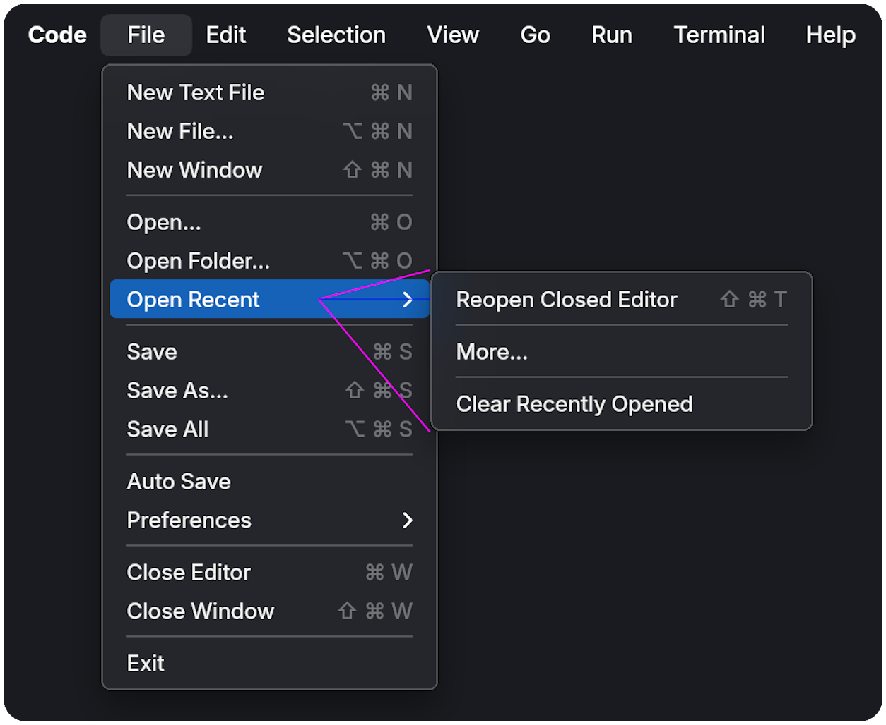
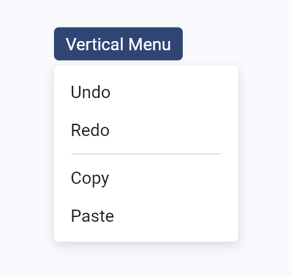
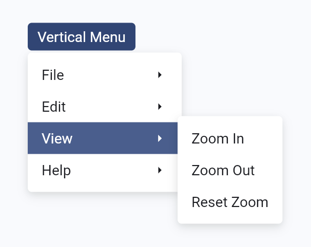
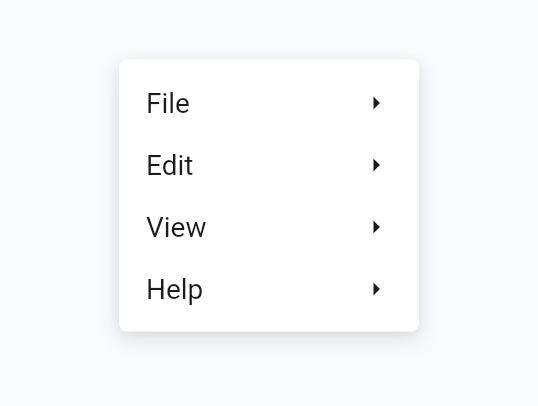
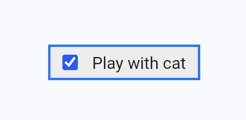
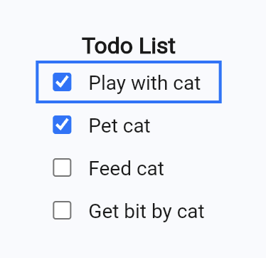
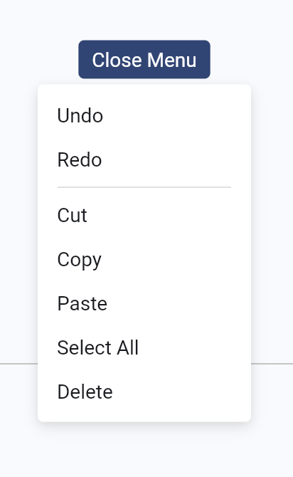

# Base Menu

Composable widgets for building menu systems in Flutter.

[](https://pub.dev/packages/base_menu)
[](#)
[](LICENSE)

[Live Gallery](https://base-menu-library.web.app/) · [Floogle Docs Demo](https://floogle-docs.web.app/) · [API Reference](https://pub.dev/documentation/base_menu/latest/)



## Features

* Completely headless. No pixels are painted by this library.
* Keyboard support that follows the [WAI-ARIA Menubar
  guidelines](https://www.w3.org/WAI/ARIA/apg/patterns/menubar/)
* Menu aim assist (safe triangles)
* A robust positioning algorithm with support for custom layout delegates
* Built on the [MenuController](https://api.flutter.dev/flutter/widgets/MenuController-class.html) API


## Architecture

Base Menu provides a small set of primitive widgets that control keyboard traversal, focus routing, and menu positioning. These widgets can be composed to create a wide variety of menu systems, from simple context menus to complex multi-level menu bars.

### Core Components

| Component | Description | Visual |
| :--- | :--- | :--- |
| `BaseMenu` | A single-layer menu overlay or context trigger. |  |
| `BaseSubmenu` | A `BaseMenu` specialized for nested menus. Coordinates cross-axis keyboard navigation and hover traversal. Uses a `BaseMenuItem` as its anchor. |  |
| `BaseMenuBar` | An inline grouping layer that coordinates keyboard and focus routing for a set of menu buttons. |  |
| `BaseMenuItem` | A primary control that adds hover-to-focus and close-on-activate actions to a `BaseControl`. |  |
| `BaseMenuPanel` | A layout container for a set of menu items. |  |

## Getting started

Add the package to your `pubspec.yaml` and import it into your project:

```dart
import 'package:base_menu/base_menu.dart';
```

## Customization

### Controls

[Full guide](./documentation/controls.md)

Add custom styling to menu items by using state selectors in a `BaseControl` or
`BaseMenuItem`.

```dart
// Implement styling for a menu item using the state selectors from BaseMenuItem.
class StyledLabel extends StatelessWidget {
  const StyledLabel({super.key, required this.child});
  final Widget child;

  static const WidgetStateProperty<BoxDecoration> decoration = WidgetStateProperty.fromMap({
    WidgetState.pressed: BoxDecoration(color: Color(0xFF2B4678)),
    WidgetState.focused: BoxDecoration(color: Color(0xFF445E91)),
    WidgetState.any: BoxDecoration(color: Color(0x00000000)),
  });

  static const WidgetStateProperty<TextStyle> textStyle = WidgetStateProperty.fromMap({
    WidgetState.disabled: TextStyle(color: Color(0xFF74777F)),
    WidgetState.pressed: TextStyle(color: Color(0xFFFFFFFF)),
    WidgetState.focused: TextStyle(color: Color(0xFFFFFFFF)),
    WidgetState.any: TextStyle(color: Color(0xFF1A1B20)),
  });

  @override
  Widget build(BuildContext context) {
    final states = BaseMenuItem.statesOf(context);
    return DecoratedBox(
      decoration: decoration.resolve(states),
      child: DefaultTextStyle.merge(
        style: textStyle.resolve(states),
        child: Padding(
          padding: const EdgeInsets.symmetric(horizontal: 8, vertical: 4),
          child: Align(alignment: AlignmentDirectional.centerStart, child: child),
        ),
      ),
    );
  }
}

// Usage:
class CustomMenuItem extends StatelessWidget {
  const CustomMenuItem({super.key, required this.child, this.onPressed});
  final Widget child;
  final VoidCallback? onPressed;

  @override
  Widget build(BuildContext context) {
    return BaseMenuItem(
      onPressed: onPressed,
      child: StyledLabel(child: child),
    );
  }
}
```

This makes it easy to swap out the styling of menu items without changing the
underlying menu logic.

### Menu

Wrap your menu panel in a `DecoratedBox` apply a background color, border, or
shadow:

```dart
class StyledMenuPanel extends StatelessWidget {
  const StyledMenuPanel({super.key, required this.child});
  final Widget child;

  @override
  Widget build(BuildContext context) {
    return DecoratedBox(
      decoration: const BoxDecoration(
        color: Color(0xffffffff),
        borderRadius: BorderRadius.all(Radius.circular(4)),
        boxShadow: [
          BoxShadow(color: Color(0x18000000), blurRadius: 8, offset: Offset(0, 4)),
          BoxShadow(color: Color(0x0D000000), blurRadius: 4, offset: Offset(0, 2)),
        ],
      ),
      child: child,
    );
  }
}

// Usage:
BaseMenu(
  menu: StyledMenuPanel(
    child: BaseMenuPanel(
      children: [
        const MenuItem(label: 'Undo'),
        const MenuItem(label: 'Redo'),
      ],
    ),
  ),
  // ...
);
```

### Positioning

[Full guide](./documentation/positioning.md)

Use `DefaultMenuPositioningDelegate` to configure the menu's position relative to its anchor:

```dart
BaseMenu(
  positionDelegate: DefaultMenuPositioningDelegate(
    // Attach the bottom-center of the anchor to the top-center of the menu
    anchorAttachment: Alignment.bottomCenter,
    menuAttachment: Alignment.topCenter,
    // Add a 4-pixel vertical gap between the anchor and the menu
    offset: Offset(0, 4),
    // Adjust the menu's vertical padding for a panel with 6 pixels of vertical padding.
    padding: EdgeInsets.symmetric(vertical: 6.0),
  ),
  // ...
)
```



### Aim assist

[Full guide](./documentation/aim.md)

| Disabled | Enabled |
| :---: | :---: |
|  |  |

To enable aim assist for a single menu, set the `enableAimAssist` property of
the menu's positioning delegate to `true`. 

To control the behavior of aim assist for a subtree, wrap the subtree with
`MenuAimScope` and set the `enable` property to `true`. All descendant menus
will inherit the `enable` value unless a descendant menu's positioning delegate
overrides it.

If a custom `MenuPositioningDelegate` is used with `BaseMenu`, the delegate is
responsible for implementing aim assist behavior. See the
[Standalone](#standalone) section for an example of how to implement aim assist
in a custom delegate.

```dart
// Enable aim assist for a subtree of menus.
MenuAimScope(
  enable: true,
  child: Column(
    children: [
      // Aim assist is enabled for this menu and its descendants.
      BaseSubmenu(
        controller: controllerOne,
        menu: ExamplePanel(),
        child: Text('File'),
      ),
      BaseSubmenu(
        controller: controllerTwo,
        // Aim assist is disabled for this menu, but not its descendants.
        positionDelegate: DefaultMenuPositioningDelegate(
          enableAimAssist: false,
        ),
        menu: ExamplePanel(),
        child: Text('Edit'),
      ),
    ],
  ),
)
```

## Contributing

Contributions are welcome! Please open an issue or submit a pull request on
GitHub. I'm especially interested in feedback on accessibility, API ergonomics,
and edge cases in keyboard traversal and menu positioning logic.
