# Menu Positioning

Menu positioning is handled by a `MenuPositioningDelegate`. This delegate
determines the size and location of the menu panel relative to its anchor (the
widget that triggered the menu).

The default implementation, `DefaultMenuPositioningDelegate`, provides a
flexible system for alignment, offsets, and handling screen overflows.

## Core Concepts

### Attachment Points

Positioning begins with two attachment points:

1.  **`anchorAttachment`**: The point on the anchor (such as a button) that the menu should attach to.
2.  **`menuAttachment`**: The point on the menu panel that aligns with the
    anchor's attachment point.

By default, `BaseMenu` uses the orientation of the menu's parent to determine
the attachment points:

*   **Horizontal or No Parent**: The anchor's `AlignmentDirectional.bottomStart` attaches to the
    menu's `AlignmentDirectional.topStart` (stacked).
*   **Vertical Parent**: The anchor's `AlignmentDirectional.topEnd` attaches to the menu's `AlignmentDirectional.topStart`
    (side-by-side).

In the images below, the green point represents the anchor's attachment, and the
red point represents the menu's attachment.

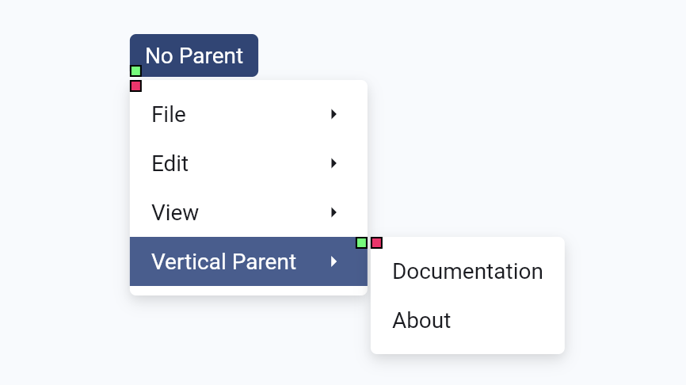
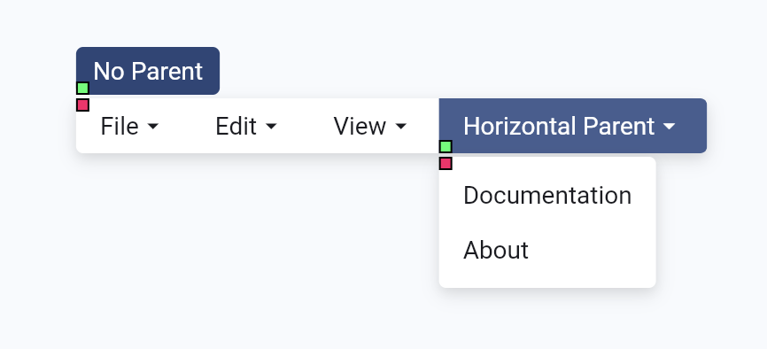


Changing the anchor attachment point to `bottomCenter` and the menu attachment
point to `topCenter` for the submenu in the second example yields:

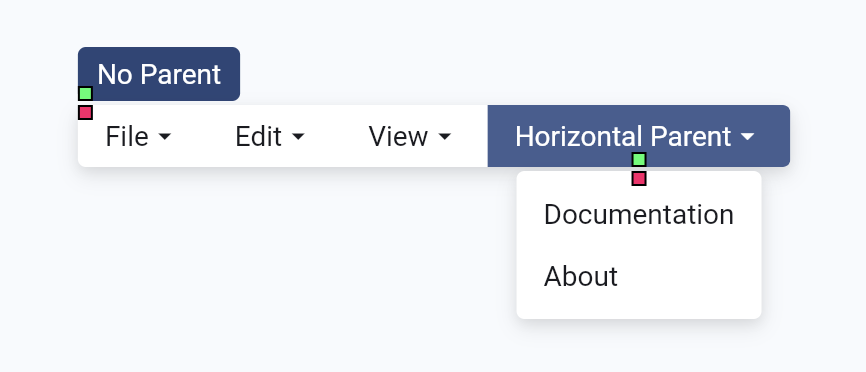


Note that the root menu's layout is unaffected by changing the submenu's
attachment points.

### Offset

The `offset` property applies a relative displacement from the calculated
attachment point. If `useDirectionalOffset` is true (default), the horizontal
component respects the ambient `Directionality`, ensuring the offset works
correctly in both LTR and RTL contexts.

The blue line in the image below represents a 10-pixel vertical offset applied
to the menu's attachment point, moving it further away from the anchor:

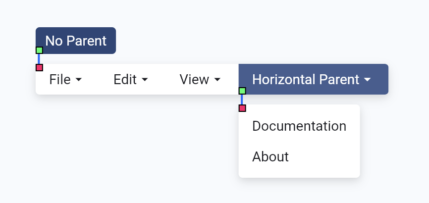


## Usage

### Basic Configuration

You can customize the positioning of any `BaseMenu` or `BaseSubmenu` by providing a `positionDelegate`.

```dart
BaseMenu(
  positionDelegate: DefaultMenuPositioningDelegate(
    // Attach the bottom-center of the anchor to the top-center of the menu
    anchorAttachment: Alignment.bottomCenter,
    menuAttachment: Alignment.topCenter,
    // Add a 4-pixel gap between the anchor and the menu
    offset: Offset(0, 4),
  ),
  menu: MyMenuPanel(),
  child: MyButton(),
)
```

### Padding

Menu panels often have padding that causes misalignment with their anchor. Use
the `padding` property to tell the positioner to ignore specific edges of the
menu's content for alignment purposes.

```dart
DefaultMenuPositioningDelegate(
  // If your menu panel has 6px of vertical padding, 
  // setting this ensures the first item aligns perfectly with the anchor.
  padding: EdgeInsets.symmetric(vertical: 6.0),
)
```

| Without padding | With padding |
| :---: | :---: |
| 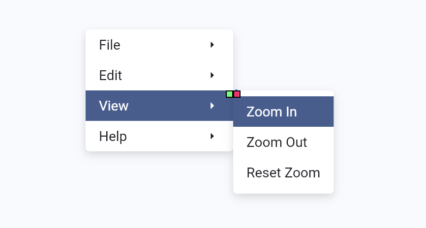 | 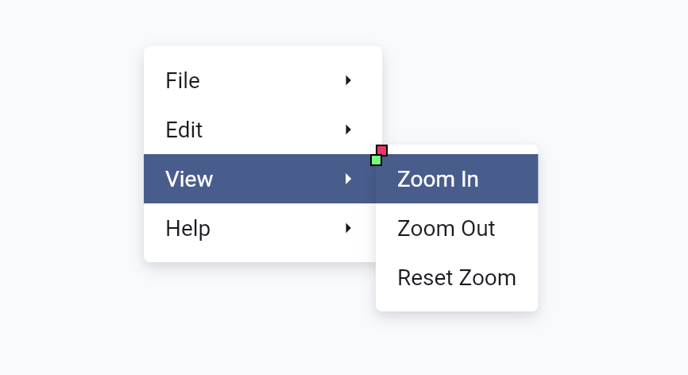 |

The positioning algorithm will automatically adapt the padding adjustment to the
menu's orientation, edge behavior, text direction, and alignment.

## Edge Behavior

When a menu would overflow the screen boundaries, the `edgeBehavior` defines how
it should react. Each axis can be configured with a combination of three
strategies:

| Strategy | Description | Example |
| :--- | :--- | :--- | 
| **`flip`** | The menu flips to the opposite side of the anchor point if it doesn't fit in its preferred position. | 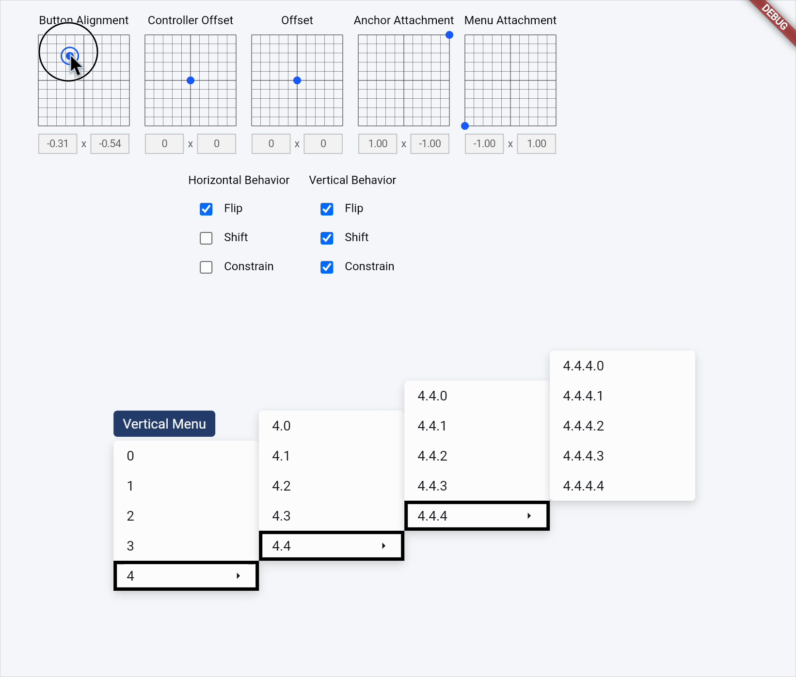 |
| **`shift`** | The menu slides along the axis to stay within the screen bounds, potentially covering the anchor. | 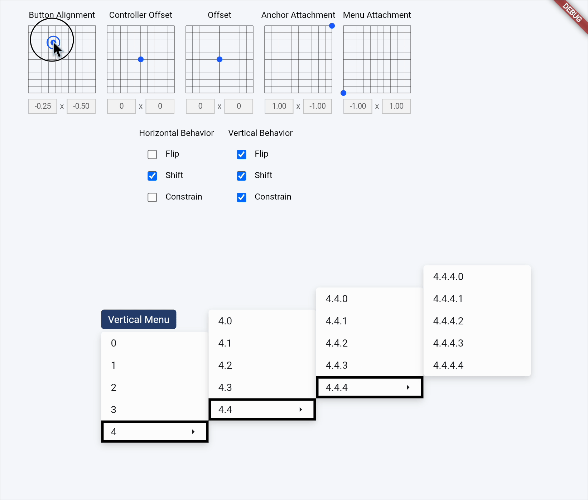 |
| **`constrain`** | The menu is resized to fit within the available space. | 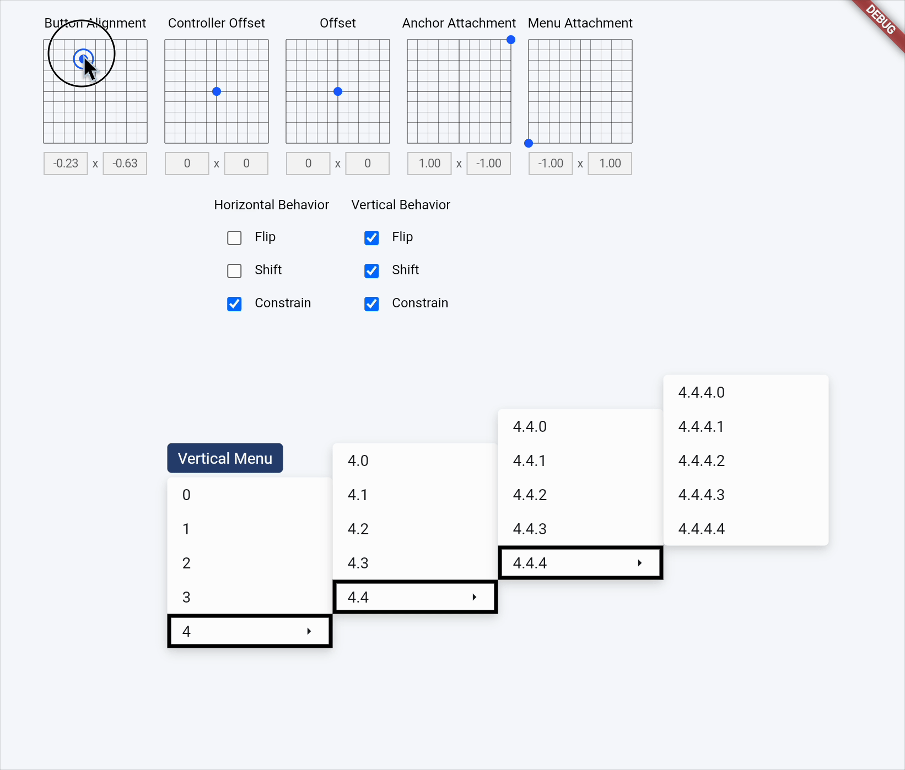 |

### Configuration Example

By default, all strategies are enabled. You can restrict this behavior for specific UX requirements:

```dart
DefaultMenuPositioningDelegate(
  edgeBehavior: EdgeBehavior(
    // The menu will flip to the horizontal side of the anchor that has the most space, but will not shift or resize.
    horizontal: EdgeBehaviorStrategy(flip: true, shift: false, constrain: false),
    // The menu will flip to the largest side, then shift within screen bounds, then resize if necessary. This is the default behavior.
    vertical: EdgeBehaviorStrategy(shift: true, constrain: true, flip: true),
  ),
)
```

Horizontal behavior with flip, shift, and constrain disabled:
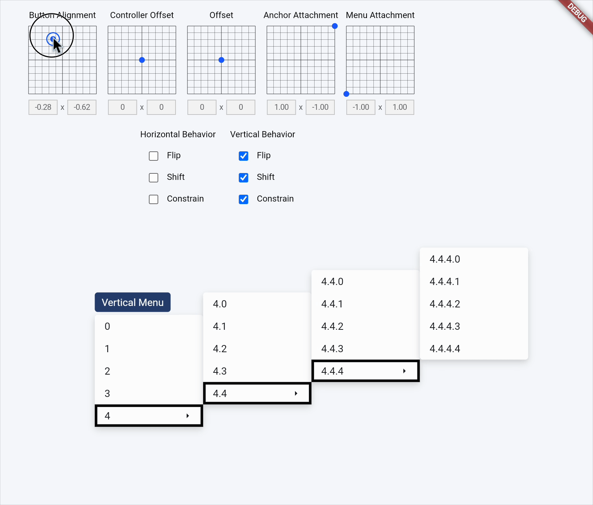

Horizontal behavior with flip enabled, shift and constrain disabled:


Horizontal behavior with shift enabled, flip and constrain disabled:


Horizontal behavior with constrain enabled, flip and shift disabled:


## Custom Positioner

The default positioner used by `BaseMenu` and `BaseSubmenu` can be replaced with a custom implementation of `MenuPositioningDelegate`. This allows for complete control over the menu's size and position:


```dart
class ExamplePositioningDelegate implements MenuPositioningDelegate {
  const ExamplePositioningDelegate();

  @override
  Widget build(BuildContext context, RawMenuOverlayInfo position, Widget child) {
    return Stack(
      children: [
        Positioned(
          // The menu is positioned against the bottom left corner of the anchor.
          left: position.anchorRect.left,
          top: position.anchorRect.bottom,
          child: Align(alignment: Alignment.topLeft, child: child),
        ),
      ],
    );
  }
}
```

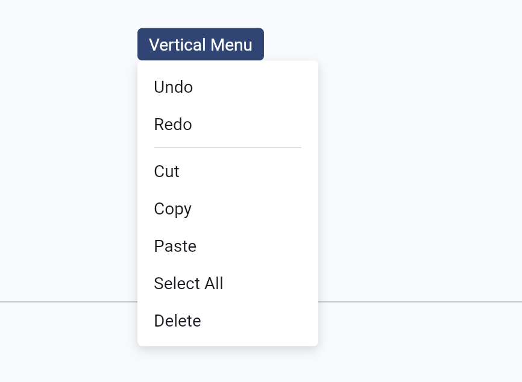